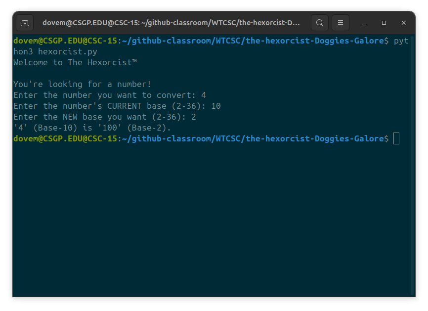

# The Hexorcist

Doing Base-Conversions the way God intended.



### Usage:
Clone it, run it, quick re-write it:
```
python3 hexorcist.py
```

### Testing:
- Tests run via pytest
- Input validation included in Test Suite
- Base validation included in Test Suite

To verify these findings, you may run:

```
pytest
```

